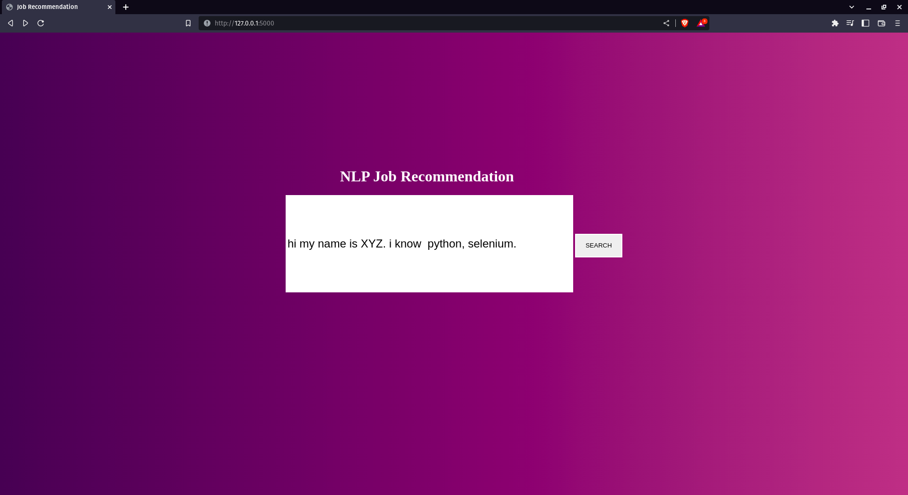

# NLP Job Recommendation

[](https://www.python.org/)
[](https://flask.palletsprojects.com/)
[](https://www.mongodb.com/)
[](LICENCE)

A Flask web application that recommends relevant jobs from a MongoDB collection based on the skills detected in a candidate's resume or written profile. It extracts recognised skills, finds jobs sharing those skills, ranks the matches, and displays role details together with a salary estimate when a salary range is available.



## Features

- Accept a free-text professional summary or a PDF resume.
- Extract text from PDFs and identify known skills using a trie-backed skills list.
- Retrieve matching listings from MongoDB.
- Rank results by overlap between candidate and job skills.
- Estimate salary for listings with a numeric salary range.
- Calculate a simple skills-based difficulty value using frequent itemsets.
- Optionally collect Naukri job listings with Selenium and Beautiful Soup.

## How it works

```text
Resume PDF or profile text
          |
          v
Text extraction + skill filtering
          |
          v
MongoDB job listings  --->  matching, ranking, salary/difficulty calculations
          |
          v
Recommended jobs in the browser
```

## Tech stack

| Area | Technology |
| --- | --- |
| Web application | Flask, Jinja templates |
| Data store | MongoDB / PyMongo |
| NLP and text processing | NLTK, spaCy model artifacts, PyPDF2 |
| Data analysis | pandas, mlxtend (Apriori) |
| Job collection | Selenium, Beautiful Soup |

## Prerequisites

- Python 3.10 or newer
- MongoDB running locally on `localhost:27017`
- Google Chrome and a ChromeDriver compatible with the installed Chrome version (only for the scraper)

## Quick start

Run the following commands from the project directory:

```bash
python -m venv .venv
source .venv/bin/activate
pip install -r requirements.txt
pip install nltk PyPDF2 pandas mlxtend
python -m nltk.downloader punkt stopwords
```

Start MongoDB, then import the included job-data export into the collection used by the web app:

```bash
mongoimport --uri "mongodb://localhost:27017" --db jobs --collection narkuri_tech_jobs --file jobs_data_json --jsonArray
```

Finally, run the application:

```bash
python app.py
```

Open [http://localhost:5000](http://localhost:5000) in a browser. Enter a summary containing your skills, or upload a text-based PDF resume, then select **Search**.

> **Windows activation:** use `.venv\\Scripts\\activate` instead of `source .venv/bin/activate`.

## Data and database setup

The app connects to:

```text
mongodb://localhost:27017
database: jobs
collection: narkuri_tech_jobs
```

Every job document needs a `skills` array. The result page also expects fields such as `title`, `url`, `experience`, `salary`, and `location`. `jobs_data_json` is a MongoDB JSON export that can be imported with the command above.

If you use your own collection, either name it `narkuri_tech_jobs` or update the database and collection names at the bottom of `app.py`.

## Collecting fresh job listings (optional)

`scrapeJobs.py` searches Naukri for terms in `skill_list.py`, extracts listing details, and inserts them into MongoDB.

```bash
python scrapeJobs.py
```

Before running it:

1. Install Chrome and a compatible ChromeDriver, and ensure it is available on your `PATH` (or configure its path in the script).
2. Review the target site's terms of use and robots rules, and scrape only where permitted.
3. Note that the scraper currently writes to the `jobs.narkuri` collection, while the web app reads `jobs.narkuri_tech_jobs`. Align those collection names if you want newly scraped records to appear in the app.

## Project structure

```text
.
├── app.py                 # Flask routes and recommendation logic
├── scrapeJobs.py          # Optional Selenium/Beautiful Soup collector
├── trie.py                # Skill-list trie and filtering helpers
├── skill_list.py          # Recognised skill vocabulary
├── jobs_data_json         # Sample MongoDB job-listing export
├── templates/             # Home and recommendation-result pages
├── images/                # README screenshots
├── output/                # Trained spaCy model artifacts
└── requirements.txt       # Core Python dependencies
```

## Notes and limitations

- The current matching logic is based on exact recognised-skill overlap; terminology not present in `skill_list.py` will not be matched.
- PDF extraction works best for PDFs that contain selectable text, not scanned images.
- Salary estimates are heuristic and should not be interpreted as compensation advice.
- Scraped listings and target-site HTML can change over time, so the scraper may need maintenance.
- `requirements.txt` contains the original core dependencies. The quick-start command installs the additional packages imported by `app.py`; consider adding them to the requirements file for a fully pinned deployment.

## Security

Keep API tokens, client secrets, and database credentials out of source control. Use environment variables or a local, ignored configuration file for sensitive values. If any credentials have been committed, revoke and rotate them before sharing or deploying the project.

## License

This project is available under the [MIT License](LICENCE).
